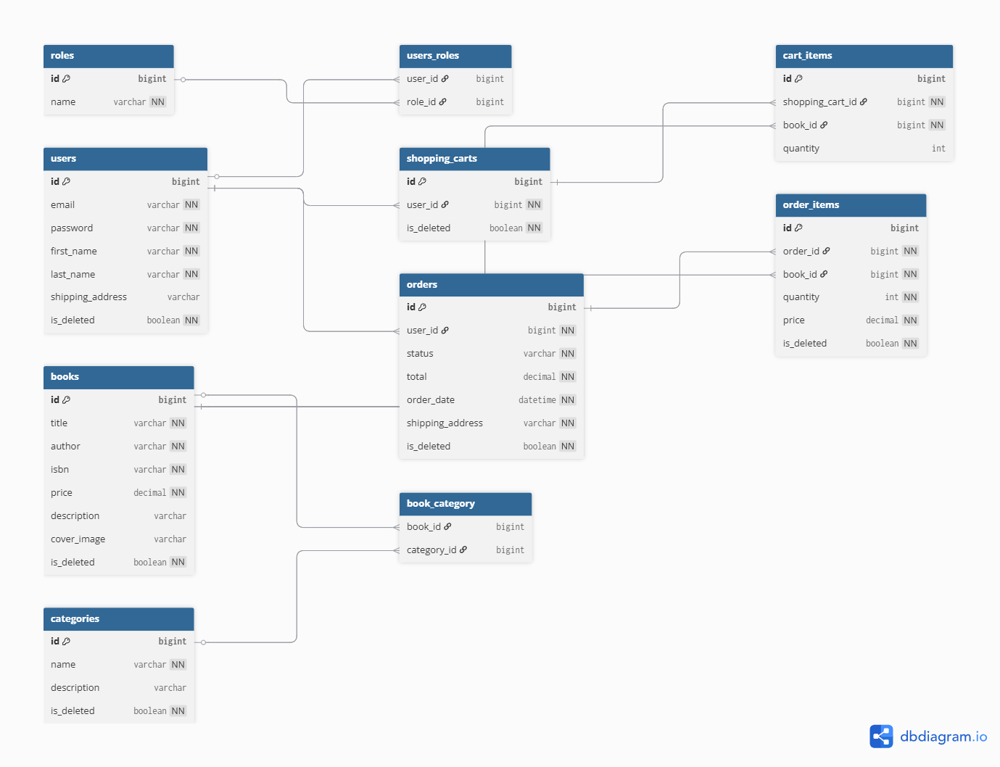

# 📚 Book Store API

## 🚀 Introduction
This project is a RESTful API for managing a book store.  
It allows users to browse books, create orders, and manage their shopping cart.

The main goal of this project is to demonstrate backend development skills using Spring Boot ecosystem.

---

## 🛠️ Technologies
- Java 17
- Spring Boot 3.4.2
- Spring Security 6.x
- Spring Data JPA 3.x
- Hibernate 6.x
- Liquibase 4.29.2
- MySQL 8.0
- MapStruct 1.5.5
- JJWT 0.11.5
- Docker 24.x & Docker Compose 2.x
- Springdoc OpenAPI (Swagger) 2.8.5
- JUnit & Mockito (via Spring Boot Test)

---

## ⚙️ Features

### 👤 Auth Controller
- Register new user
- Login (JWT authentication)

### 📚 Book Controller
- Get all books (pagination supported)
- Get book by id
- Create / Update / Delete book (admin only)

### 🗃️ Category Controller
- Get all categories (pagination supported)
- Get category by id
- Get all books from category id
- Create / Update / Delete category (admin only)

### 🛒 Shopping Cart Controller
- Add book to cart
- View cart
- Update quantity
- Remove item

### 📦 Order Controller
- Create order
- Get user orders
- Get order details
- Update order status (admin only)

---

## 🔐 Security
- JWT-based authentication
- Password encryption using BCrypt
- Role-based access control
- Protected endpoints for ADMIN operations

## 🔐 Environment Variables

The project uses environment variables for configuration.

Create a `.env` file in the root directory:

```env
MYSQLDB_ROOT_PASSWORD=
MYSQLDB_DATABASE=book_store_db
MYSQLDB_USER=
MYSQLDB_PASSWORD=
MYSQLDB_LOCAL_PORT=3307
MYSQLDB_DOCKER_PORT=3306
SPRING_LOCAL_PORT=8080
SPRING_DOCKER_PORT=8080
```
---

## ⚠️ Error Handling

The application uses a centralized error handling mechanism based on `@ControllerAdvice`.

### 🔧 Global Exception Handler

All exceptions are handled in a single place using a custom `GlobalExceptionHandler`, which extends `ResponseEntityExceptionHandler`.

---

### 📌 Handled Exceptions

| Exception                     | HTTP Status | Description                          |
|------------------------------|------------|--------------------------------------|
| DataProcessingException      | 500        | Internal server/database errors      |
| EntityNotFoundException      | 404        | Entity not found                     |
| RegistrationException        | 409        | User already exists / conflict       |
| OrderProcessingException     | 400        | Invalid order request                |
| Exception (global fallback)  | 500        | Unexpected server errors             |

---

### 🧾 Validation Errors

Validation errors (e.g. invalid request body) are handled automatically.

---
## ▶️ How to Run

### 1. Clone repo
```bash
git clone https://github.com/KucherenkoOS/Spring-Boot-Intro.git
cd Spring-Boot-Intro
```
### 2. Run with Docker
Make sure you have Docker and Docker Compose installed.

Build and start containers:

```bash
docker-compose up --build
```
This will start:

- MySQL database
- Spring Boot application

To stop:
```bash
docker-compose down
```

### 3. Application will be available at:
http://localhost:8080

## 📬 API Endpoints

### 🔐 Authentication

#### Register
POST /auth/registration
- Creates a new user account
- Available without authorization

#### Login
POST /auth/login
- Returns JWT token
- Available without authorization

---

### 📚 Books

#### Get all books
GET /books
- Role: USER
- Supports pagination

#### Get book by ID
GET /books/{id}
- Role: USER

#### Create book
POST /books
- Role: ADMIN

#### Update book
PUT /books/{id}
- Role: ADMIN

#### Delete book
DELETE /books/{id}
- Role: ADMIN

---

### 📂 Categories

#### Get all categories
GET /categories
- Role: USER

#### Get category by ID
GET /categories/{id}
- Role: USER

#### Create category
POST /categories
- Role: ADMIN

#### Update category
PUT /categories/{id}
- Role: ADMIN

#### Delete category
DELETE /categories/{id}
- Role: ADMIN

---

### 🛒 Shopping Cart

#### Get cart
GET /cart
- Role: USER

#### Add item to cart
POST /cart
- Role: USER

#### Update cart item
PATCH /cart/{cartItemId}
- Role: ADMIN ⚠️ (based on current config)

#### Remove item from cart
DELETE /cart/{cartItemId}
- Role: USER

---

## 🔑 Authorization

Most endpoints require JWT token:

Authorization: Bearer <your_token>

---

## ⚠️ Access Control Summary

| Endpoint        | Method | Role   |
|----------------|--------|--------|
| /auth/**       | ALL    | Public |
| /books         | GET    | USER   |
| /books         | POST   | ADMIN  |
| /books/{id}    | PUT    | ADMIN  |
| /books/{id}    | DELETE | ADMIN  |
| /categories    | GET    | USER   |
| /categories    | POST   | ADMIN  |
| /categories/{id}| PUT   | ADMIN  |
| /categories/{id}| DELETE| ADMIN  |
| /cart          | GET    | USER   |
| /cart          | POST   | USER   |
| /cart/{id}     | PATCH  | ADMIN  |

---
## 📄 API Documentation

- Swagger UI:
http://localhost:8080/swagger-ui/index.html
- Postman collection available in the repository
---
## 🧪 Testing

The project includes:

- Unit tests (JUnit + Mockito)
- Repository tests (@DataJpaTest)
- Service layer tests with mocked dependencies

Run tests:
```bash
mvn test
```
## 📬 Postman Collection

You can test API endpoints using Postman.

1. Import collection from:
   `postman/BookStoreAPI.postman_collection.json`

2. Run login request to obtain JWT token

3. Token will be automatically saved and used for authorized requests

## 🗄️ Database
- MySQL is used as the primary database
- Hibernate (JPA) is used for ORM
- Database schema is managed via Liquibase changeSets
- All schema changes are version-controlled and applied automatically on application startup

## 🧩 Database Diagram



## ⚡ Challenges
- Designing clean architecture (Controller → Service → Repository)
- Implementing secure JWT authentication
- Managing entity relationships
- Writing testable and maintainable code